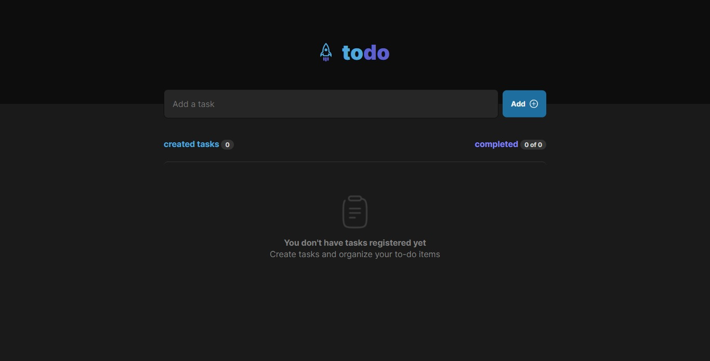
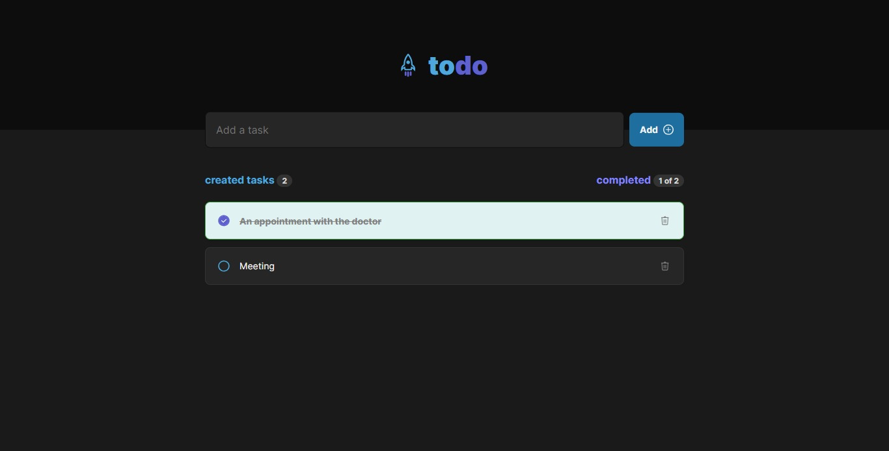

# To-Do App

This is a simple To-Do app built using React that allows you to manage your tasks and keep track of your to-do items.

## Table of Contents

- [To-Do App](#to-do-app)
  - [Table of Contents](#table-of-contents)
  - [Description](#description)
  - [Features](#features)
  - [Live Demo](#live-demo)
  - [Installation](#installation)
  - [Usage](#usage)
  - [Screenshots](#screenshots)
  - [Contributing](#contributing)
  - [Contact Me](#contact-me)

## Description

The To-Do app provides a user-friendly interface for adding, completing, and deleting tasks. It's built using React, and it uses React hooks for state management. The app includes components for the header, form input, task list, and individual tasks.

## Features

- Add new tasks: Enter task descriptions and add them to the task list.
- Mark tasks as completed: Toggle the checkbox to mark tasks as completed.
- Delete tasks: Remove tasks from the list with the delete button.
- Task Statistics: Displays the number of tasks created and completed.
- Responsive Design: The app is designed to work well on various screen sizes.

## Live Demo

Check out the live demo of the app [here](https://best-todo-list.web.app/).

## Installation

To run the app locally, follow these steps:

1. Clone this repository to your local machine
2. Navigate to the project directory
3. Install the required dependencies
4. Start the development server
5. Open your web browser and go to `http://localhost:3000` to see the app in action.

## Usage

1. Enter a task in the input field and click the "Add" button to add it to the list.
2. Click the checkbox next to a task to mark it as completed.
3. Click the delete button to remove a task from the list.
4. The task statistics section provides information about the number of created and completed tasks.

## Screenshots

## Contributing

Contributions are welcome! If you find any issues or would like to add enhancements, feel free to open a pull request.

## Contact Me

If you have any questions or suggestions, feel free to contact me:

- GitHub: [Adham Nasser](https://github.com/Adhamxiii)
- Linkedin: [Adham Nasser](https://www.linkedin.com/in/adhamnasser/)
